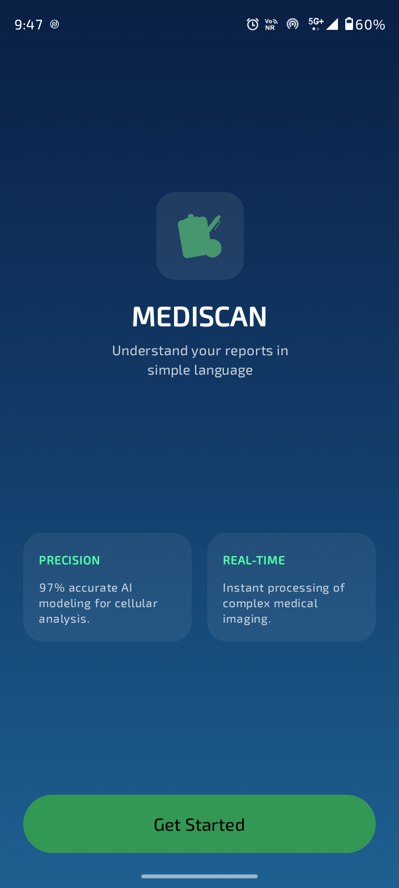
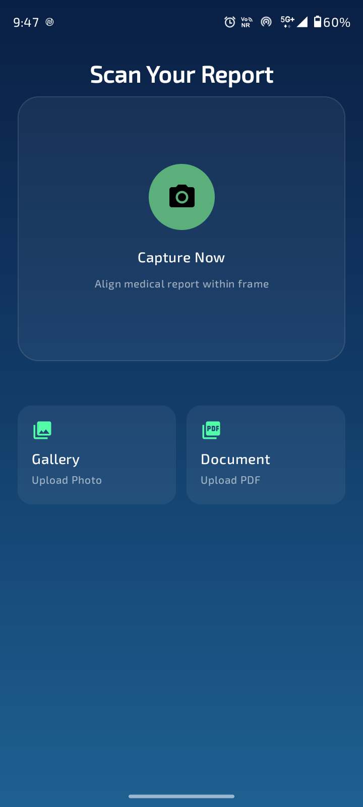
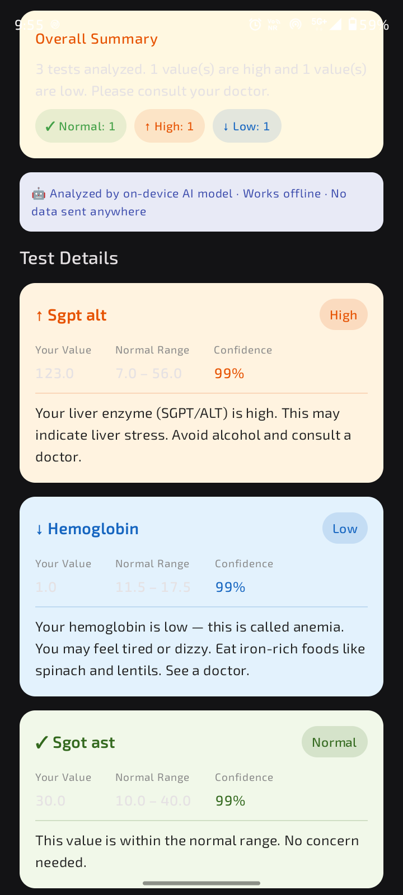

<div align="center">

# 🩺 MediScan

### Understand your medical reports with AI-powered health insights.

Upload or scan medical reports and receive simplified explanations, key health indicators, and easy-to-understand insights generated using on-device AI.


</div>

---

## 📖 Overview

Medical reports often contain complex terminology and technical values that can be difficult for patients to understand.

**MediLens AI** helps bridge this gap by using Machine Learning to analyze medical reports and provide simplified explanations of important health metrics.

Users can upload or scan reports directly from their device, and the application extracts relevant information, analyzes report values, and generates easy-to-understand health insights.

The goal is not to replace healthcare professionals but to help users better understand their reports before consulting a doctor.

---
## 📱 App Screenshots

<table align="center">
  <tr>
    <td align="center"><b>🏠 Home Screen</b></td>
    <td align="center"><b>📤 Upload Screen</b></td>
    <td align="center"><b>📄 Report Screen</b></td>
  </tr>

  <tr>
    <td>
      
    </td>
    <td>
      
    </td>
    <td>
      
    </td>
  </tr>
</table>


## ✨ Features

### 📷 Report Scanning

Capture medical reports directly using CameraX.

- Real-time camera preview
- Document capture
- Fast image processing

### 🧠 AI-Powered Analysis

Analyze report data using a trained Machine Learning model.

- Detect important health parameters
- Generate simplified explanations
- Highlight abnormal values

### 📄 Report Management

Store and manage previously analyzed reports.

- Save reports locally
- View analysis history
- Revisit previous insights

### 🔍 Key Health Indicators

Automatically identifies critical metrics such as:

- Hemoglobin
- Blood Sugar
- Cholesterol
- Blood Pressure

### 📊 Simplified Insights

Converts complex medical jargon into easy-to-understand summaries.

Example:

> Your blood sugar level is slightly above the normal range and may require monitoring.

### 🖼 Image Preview Support

View scanned reports seamlessly using Coil image loading.

### 📶 Offline Support

Previously scanned reports remain accessible using Room Database.

---

## 🏗 Architecture

MediLens AI follows the **MVVM (Model–View–ViewModel)** architecture pattern.

```text
UI (Jetpack Compose)
          ↓
      ViewModel
          ↓
      Repository
      ↙       ↘
   Room      ML Engine
 (Local)   (TensorFlow Lite)
```

---

## 🧠 Tech Stack

| Category | Technology |
|-----------|------------|
| Language | Kotlin |
| UI Toolkit | Jetpack Compose |
| Design System | Material 3 |
| Architecture | MVVM |
| Local Database | Room |
| Camera | CameraX |
| Image Loading | Coil |
| Navigation | Navigation Compose |
| State Management | StateFlow |
| Async Programming | Kotlin Coroutines |
| Machine Learning | TensorFlow Lite |
| Model Training | Keras |
| Data Persistence | Room Database |

---

## ⚙️ Core Functionality

### Medical Report Capture

Uses CameraX to scan reports directly within the application.

```kotlin
imageCapture.takePicture(...)
```

Benefits:

- Fast capture
- High-quality images
- Seamless user experience

---

### Machine Learning Pipeline

#### Step 1: Report Acquisition

- Capture report image
- Load image from gallery

#### Step 2: Data Extraction

- Extract relevant report information
- Process report values

#### Step 3: AI Analysis

The trained Keras model evaluates:

- Normal ranges
- Abnormal findings
- Health risk indicators

#### Step 4: Insight Generation

The application generates:

- Simple explanations
- Health summaries
- Important observations

---

### Local Report Storage

All analyzed reports can be stored locally using Room.

Benefits:

- Faster access
- Offline support
- Historical tracking

---

## 🚀 Future Enhancements

- PDF report support
- Multi-language report explanations
- Voice-based report summaries
- Health trend tracking
- Personalized recommendations
- Doctor consultation integration
- Cloud synchronization

---

## 🤝 Contributing

Contributions, suggestions, and feedback are welcome.

If you would like to contribute:

1. Fork the repository
2. Create a feature branch
3. Commit your changes
4. Open a Pull Request

---

## 👩‍💻 Author

**Komal Singh**

Android Developer • Open Source Contributor • Aspiring Generative AI Engineer

---

## ⚠️ Disclaimer

MediLens AI is intended for educational and informational purposes only.

The insights generated by the application should not be considered medical advice, diagnosis, or treatment. Always consult a qualified healthcare professional regarding medical concerns.

---

## 📄 License

This project is licensed under the MIT License.

See the LICENSE file for more information.

---

⭐ If you find this project useful, consider giving it a star.
